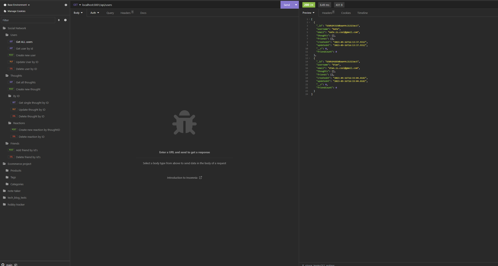
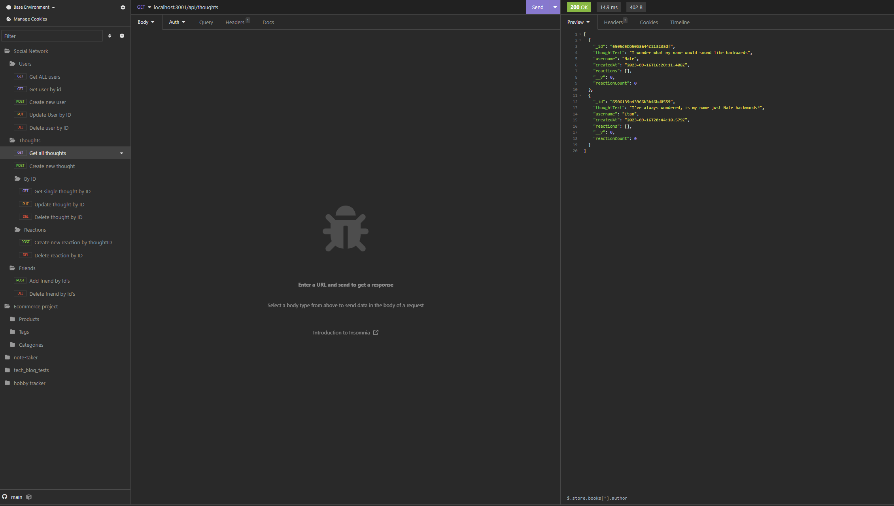

# Social_Network_API
The project for week 18---Making the API for a social network

## Table of Contents
 - [Installation](#installation)
 - [usage](#usage)
 - [License](#license)
 - [Features](#featues)
 - [Contribution Guidelines](#contributing)
 - [Questons/Contact](#questions)

# Description
The social network project aims to create a web-based platform that allows users to connect, share thoughts, and interact with friends. It provides a space for users to express themselves, engage with others, and build a social network online. This project will use a combination of technologies such as Express.js, MongoDB, and Mongoose to create a robust and scalable social network application.

## Installation
For this project will need:
- express.js
- MangoDb
- Mangoose
- Some kind of API development testing platform such as Insomnia

## Usage
Due to this project only having backend properties, using your API testing platform such as Insomnia, or Postman you can GET, create, update, or delete users, thoughts, and reactions. Users can perform and these actions to manipulate the database to create users, add thoughts and reactions to them. Add also update them or delete them.

## License
This project does not currently have a license.

## Features
1. User profiles:
    - Profiles can be created using username and emails
    - Profile information can be updated, including both username and email
2. Posting Thoughts:
    - Thoughts can created and posted to a user.
    - Thoughts can have a character limit, and they are timestamped with the date and time of creation.
    - Thoughts can be edited or deleted by the user who posted them
3. Interactions:
    - Users can react to thoughts with comments or "reactions".
    - Users can see a list of thoughts they've reacted to or commented on.
    - Users can see a list of their friends' thoughts and interact with them.
4. Friendship management:
    - Friends can be added to users
    - Doing so will auto-increase the number of friends that user has or the friendCount.

## Contribution Guidelines
This is a private project for instructional purposes. Future contributions are unlikely but possible.

## Questions
For any questions, please contact me:

GitHub: [Nate's GitHub](https://github.com/imdawizard)

Email: nate.is.cool.yeah@gmail.com

### Link to deployed application:
- https://github.com/imdawizard/Social_Network_API

### Link to walkthourgh video:
- https://drive.google.com/file/d/1_-B3-TpHs-4jX1zbRrov1rSR6BlSt0Qt/view 

## Screenshots

